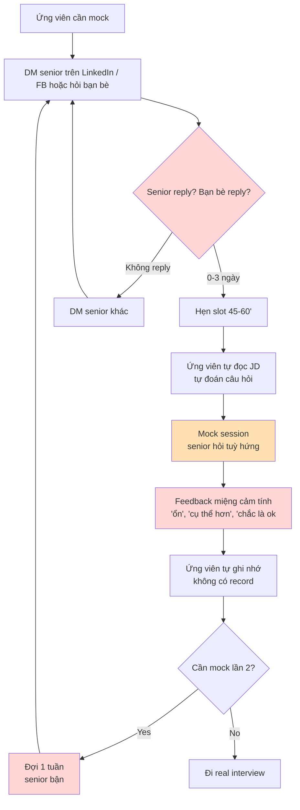
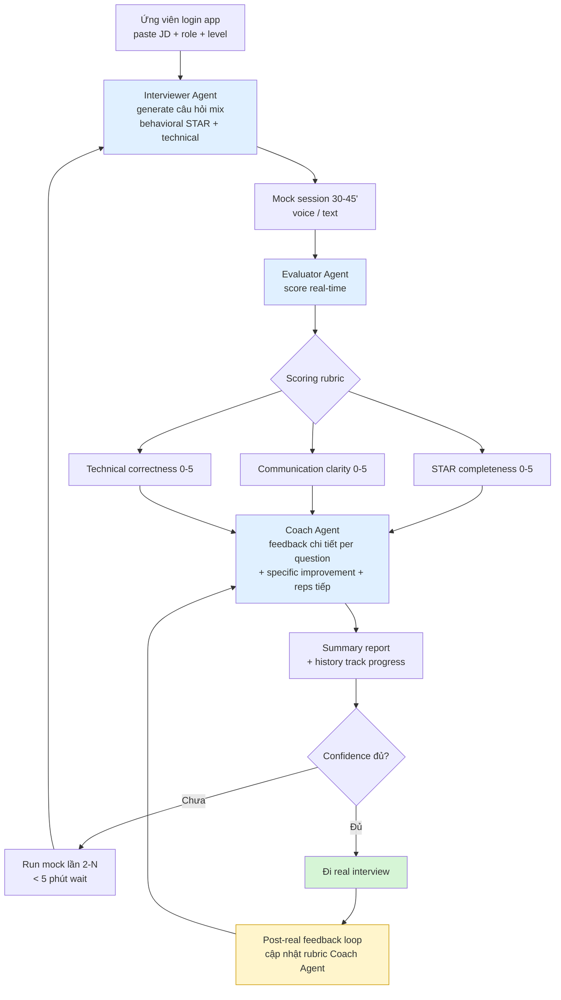
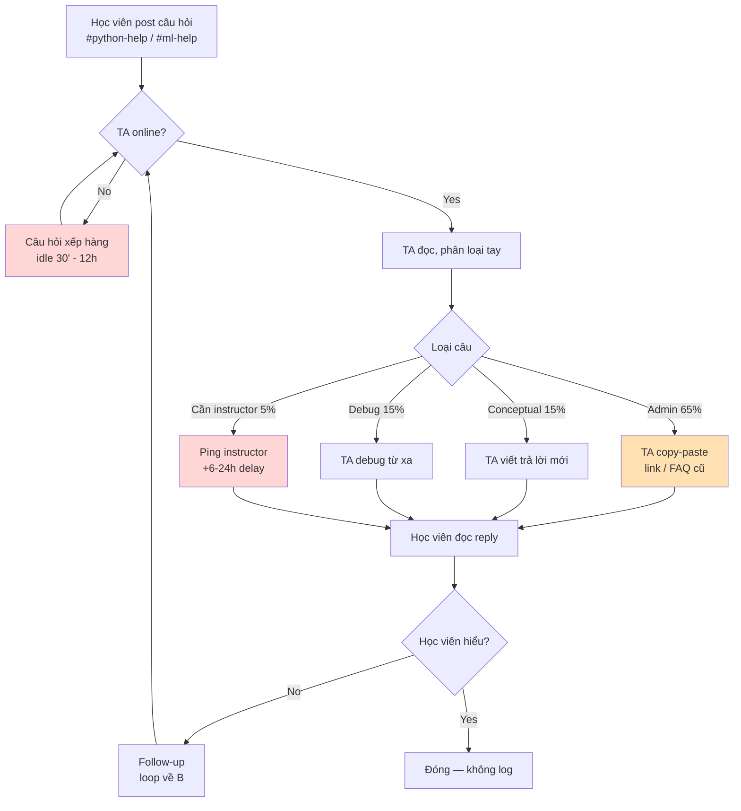
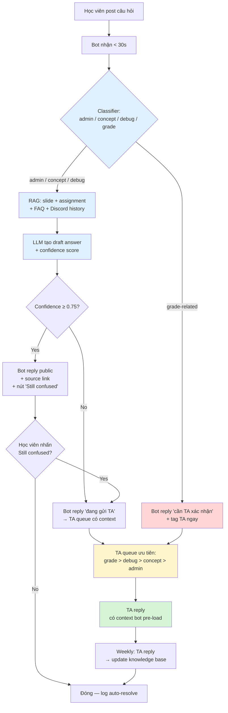
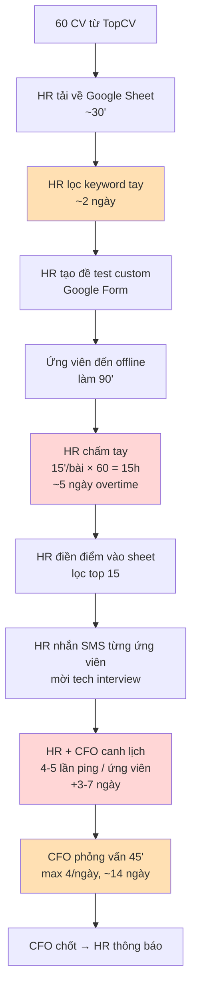
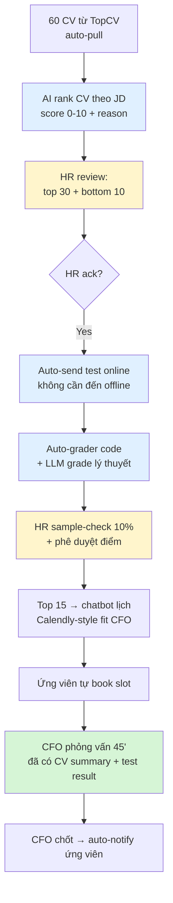

# 01 — Individual Problem Scan

> Học viên: Vo Huyen Khanh May (SV-VHKM) · Batch 02

## Scan rộng

| # | Lăng kính | Problem quan sát được | Ai đang đau? | Dấu hiệu thật |
|---|---|---|---|---|
| 1 | Lặp lại | Câu hỏi admin lặp lại của 500 học viên trên Discord (deadline, link slide, video) | TA, học viên | TA/thầy cô trả lời các câu hỏi giống nhau. Quan sát thấy mọi người trình bày vấn đề trên discord |
| 2 | Tốn thời gian | Chấm bài tập + feedback cho 500 học viên × 8 lab | TA, học viên | 125 bài/TA/đợt, feedback 1-3 dòng |
| 3 | AI có thể tốt hơn | Tóm tắt video buổi học 3h không có tài liệu để học viên ôn lại | Học viên bận không tham gia được | Hỏi "hôm nay học gì thế các bạn' = nhóm không ai trả lời hoặc bạn tự xem lại đi?? |
| 4 | Tốn thời gian | HR pipeline tuyển intern AI 4 bước, chấm test tay 60 bài/đợt | HR, CFO, ứng viên | Cycle 30 ngày, ứng viên giỏi mất offer khác |
| 5 | AI có thể tốt hơn | Mock interview cho sinh viên năm cuối, senior bận | Sinh viên, senior | 1 mock/tuần là cùng, câu hỏi lặp |
| 6 | AI có thể tốt hơn | Phân loại + score CV ứng viên junior từ pool TopCV | HR | 60 CV/đợt × 5 phút filter tay |
| 8 | Pain từ người khác | Tìm phòng có ổ cắm + map campus VinUni khi học offline | Học viên mới | 10-15 phút mỗi buổi |


## Top 3

| Rank | Problem | Vì sao chọn | Điều còn chưa chắc |
|---|---|---|---|
| 1 | AI giúp mock interview | Pain rõ, AI fit cho phần ngôn ngữ tự nhiên | Đo "chất lượng feedback" thế nào, ứng viên có chịu trust AI không |
| 2 | AI TA at scale (Câu hỏi lặp lại học viên) | Workflow rõ, log Discord đo được, baseline tốt, tôi đang sống trong pain | Conceptual câu hỏi AI trả có chính xác không, cũng phải là TA nên không chắc pain? |
| 3 | HR pipeline tuyển intern | Workflow 4 bước rõ, cycle time 30 ngày là metric mạnh | Không access trực tiếp data, phải remote validate, bản thân không làm HR không biết |

---

## Problem Card #1 — Mock interview multi-agent

**Problem 1 câu:**
Sinh viên / career switcher fail real interview vì thiếu reps mock thực sự professional; mock với bạn senior thiếu rubric, chỉ được 1-2 buổi/tuần.

**Actor:**
- Primary: Sinh viên năm cuối + career switcher chuẩn bị apply role tech / AI / data (~vài chục nghìn/năm ở VN).
- Secondary: Senior engineers/PM thường được nhờ mock cho friends, overload, từ chối 2-3 yêu cầu/tháng.

**Thời điểm / bối cảnh:**
Trước khi apply (recruiting season Q3 + Tết + thời điểm sinh viên chuẩn bị tốt nghiệp/xin thực tập) và suốt quá trình tìm việc, thường 1-3 tháng.

**Current workflow:**

```text
1. Ứng viên DM senior trên LinkedIn/FB: "anh/chị mock cho em được không?" hoặc hỏi "bạn ơi giúp tôi luyện phỏng vấn cái" với bạn bè
2. Senior/friend reply (0-3 ngày), hẹn slot 45-60'
3. Ứng viên tự đọc JD, tự đoán câu hỏi
4. Mock session: senior hỏi tuỳ hứng (lặp behavioral + hỏi đại), không rubric
5. Cuối session: feedback miệng cảm tính ("ổn", "cụ thể hơn")
6. Ứng viên tự ghi nhớ, ít khi viết lại
7. Muốn mock lần 2 → senior bận → lặp bước 1, đợi thêm 1 tuần
```

**Bottleneck:**
- **Throughput**: Senior 1 mock/tuần là cùng → ứng viên đợi 1 tuần giữa 2 lần.
- **Quality**: Feedback không structured (STAR, communication, technical correctness chấm chung) → ứng viên không biết sửa cụ thể gì.
- **No memory**: Mock lần 2 senior không nhớ lần 1 → không track progress.

**Impact:**
- Mini-survey 2 friends đang job hunt + chính tôi: trung bình **1 mock** trước real interview, có người 0. 
- Senior từ chối 2-3 yêu cầu mock/tháng vì bận -> ứng viên đi real interview hữu duyên.
- Cost cơ hội: fail real interview, lại tốn 3-6 tháng job search kéo dài, ảnh hưởng tâm lý,

**Success metric:**
- Số mock/ứng viên trước real interview: **1 → >= 3** (proxy: reps).
- Time-to-mock: 1-3 ngày chờ senior → **< 5 phút** (luôn available).
- % session có rubric structured (STAR + communication + technical scores): **0% → 100%**.
- Confidence score self-reported (1-5) trước real interview: baseline TBD → **+1 điểm** sau ≥ 5 mock.

**Non-AI alternative:**
- Pramp, Interviewing.io: peer-to-peer mock free. Pro: free. Con: peer cũng raw, không behavioral STAR, chỉ technical.
- Hire 1:1 coach ($100-200/session): chất lượng cao, không scale, đắt với sinh viên VN.

**AI hypothesis:**
Multi-agent: **Interviewer agent** (hỏi behavioral STAR + technical theo JD/role) + **Evaluator agent** (scoring rubric: STAR completeness, communication clarity, technical correctness) + **Coach agent** (feedback chi tiết + specific improvements + suggested next reps + summary report). Ứng viên chạy mock bất kỳ lúc nào, hệ thống lưu history để track progress.

**Phán đoán ban đầu:**
**Agent** (multi-agent) — một trong số ít case Agent justified vì high ambiguity (câu trả lời open-ended) + multi-step orchestration (hỏi -> đánh giá → coach) + output có thể verify qua kết quả real interview + sử dụng ngôn ngữ tự nhiên, input đa biến -> không rule/khó workflow.

### Draft current workflow



### Draft future workflow



**Boundary**: AI **không** thay thế real recruiter, feedback Coach là gợi ý không phải absolute truth; rubric phải được senior thật review trước launch và cập nhật mỗi quý.

**Fallback**: nếu Evaluator confidence < threshold (vd câu trả lời ngắn / off-topic) → flag "cần human reviewer", không scoring tự động.

---

## Problem Card #2 — AI TA at scale

**Problem 1 câu:**
10 TA part-time không kịp trả lời 500 học viên Foundation Track, học viên phàn nàn nhiều trên discord

**Actor:**
các TA part-time (~10h/tuần/người) chịu trách nhiệm Discord support cho 500 học viên Batch 02 Foundation Track.

**Thời điểm / bối cảnh:**
Hằng ngày trên Discord, peak vào buổi tối và cận deadline assignment (mỗi 2 tuần).

**Current workflow:**

```text
1. Học viên post câu hỏi vào #python-help hoặc #ml-help
2. Câu hỏi nằm trong feed, đợi TA online (30' - 12h idle)
3. TA đọc, phân loại tay (admin / conceptual / debug / cần instructor)
4. TA trả lời: copy-paste FAQ (admin) hoặc viết mới (conceptual) hoặc debug từ xa (lỗi code)
5. Nếu cần instructor → TA ping instructor, delay thêm 6-24h
6. Học viên đọc reply, có thể follow-up → loop về bước 2
7. Đóng câu hỏi (không log, không re-use)
```

**Bottleneck:**
Bước 2 (idle wait) + Bước 4 (TA copy-paste cùng nội dung 10-15 lần/ngày). Hai bottleneck cộng hưởng: TA bận với câu admin lặp → câu conceptual delay 12-36h.

**Impact:**
- TA: ~65% thời gian (~26h/tuần/người) cho câu lặp lại.
- Học viên: median wait 6h, peak 36h, 27% từng bỏ task vì chờ quá lâu (survey 15 hv).
- Batch 01: 8 học viên drop, 3 trong đó nói lý do là "không được hỗ trợ kịp".
- Mở Batch 03 (1000 hv): nếu giữ workflow này, cần thêm 4 TA nữa (~$6k/tháng).

**Success metric:**
- Median wait admin: 6h → < 30'.
- % câu auto-resolve không cần TA: 0% → ≥ 50%.
- % thời gian TA cho câu lặp: 65% → < 25%.
- Sai sót bot trên câu auto-resolve: < 5% (TA spot-check 50 câu/tuần).

**Non-AI alternative:**
Pinned FAQ + slash commands Discord (đang dùng — chỉ catch ~15% vì học viên không scroll). Thuê thêm 2 TA full-time (~$6k/tháng, không bền vững khi mở Batch 03).

**AI hypothesis:**
RAG bot trên course materials + classifier intent + confidence-based escalation. AI trả admin + concept ngắn + debug bước đầu; TA review queue cho confidence thấp và keyword grade-related.

**Phán đoán ban đầu:**
Workflow.

### Draft current workflow



### Draft future workflow



**Boundary**: AI **không** trả deadline / grade / exception / refund / emotional. Mọi keyword grade-related → hard-route TA.

**Fallback**: bot không tìm thấy source → "đang gửi TA", không bịa. "Still confused" 1 lần → force-escalate.

---

## Problem Card #3 — HR pipeline tuyển intern AI

**Problem 1 câu:**
HR + CFO của công ty AI ~30 người dùng quy trình tuyển intern 4 bước thủ công kéo dài ~30 ngày; ~30% ứng viên giỏi mất offer khác trước khi đến vòng cuối.

**Actor:**
- Primary: **HR** (1 người, kiêm 5 mảng).
- Decision maker: **CFO** (lịch kín, phỏng vấn cuối).
- Bị ảnh hưởng: **60 ứng viên/đợt** (mỗi 3 tháng/đợt).

**Thời điểm / bối cảnh:**
Mỗi đợt tuyển intern AI 3 tháng/lần, peak Tết + Q3 (giáp năm học).

**Current workflow:**

```text
1. HR vào TopCV, tải CV về Google Sheet (~30')
2. HR lọc CV thủ công theo keyword JD ('Python', 'PyTorch', 'TF') trên sheet (~2 ngày)
3. HR tạo đề test custom (Google Form ~30 câu), kêu ứng viên đến offline làm 90'
4. HR chấm tay từng bài ngoài giờ (~15'/bài × 60 = 15h thuần, ~5 ngày)
5. HR điền điểm vào sheet, lọc top ~15 ứng viên
6. HR nhắn SMS từng người mời phỏng vấn technical online
7. HR + CFO canh lịch (4-5 lần ping qua lại / ứng viên)
8. CFO phỏng vấn online 45'/ứng viên, spread ~14 ngày
9. CFO chốt, HR thông báo
```

**Bottleneck:**
- **Bước 4 (chấm test tay)**: 15h thuần → HR overtime cuối tuần.
- **Bước 7 (sắp lịch CFO)**: 4-5 lần ping → delay 3-7 ngày/ứng viên.
- **Bước 8 (CFO bottleneck)**: max 4 phỏng vấn/ngày → 15 ứng viên = 4-14 ngày, ~50% rớt sau 5'.

**Impact:**
- Cycle time **~30 ngày** từ apply đến offer.
- **~30%** ứng viên top từ chối vì có offer khác trong lúc chờ (HR ước lượng).
- HR overtime 2-3 ngày/tháng (chấm + sắp lịch).
- CFO than: 50% phỏng vấn rớt sau 5' đầu — lãng phí slot CFO.

**Success metric:**
- Cycle time: **30 ngày → < 14 ngày**.
- % ứng viên top accept offer: chưa log → target **> 60%**.
- HR overtime / đợt: **24h → < 6h**.
- % phỏng vấn CFO rớt < 5': **50% → < 20%** (pre-screen tốt hơn).

**Non-AI alternative:**
- Greenhouse / Workable: $200-500/tháng/user, overkill cho 60 ứng viên/đợt.
- Thuê HR part-time mùa cao điểm: ~$800/tháng, vẫn không giải vấn đề chấm offline + sắp lịch CFO.
- TopCV native filter: chỉ keyword cơ bản, không score theo JD.

**AI hypothesis:**
- Bước 1-2: **auto-rank CV theo JD** (LLM đọc CV + score 0-10 theo rubric JD), HR review top 30 + bottom 10 để chắc.
- Bước 3-4: **auto-grader** cho phần code (test case) + LLM grade phần lý thuyết theo rubric, HR sample-check 10%.
- Bước 6-7: **chatbot lịch** (Calendly-style) + auto-suggest slot fit CFO.

**Quick gut:**
Workflow (pipeline orchestration end-to-end, không cần Agent autonomous).

### Draft current workflow



### Draft future workflow



**Boundary**: AI **không** ra quyết định hire/reject cuối; HR luôn review top + bottom CV (catch AI bias); test score < 70% nhưng CV mạnh → đẩy lên review tay thay vì auto-reject; CFO interview là human boundary cuối.

**Fallback**: AI score CV confidence thấp → cho vào "manual review pile" thay vì auto-rank; chatbot lịch fail → fall back về SMS tay.

---
