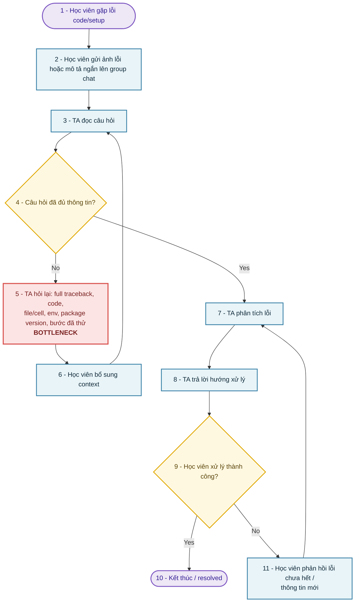
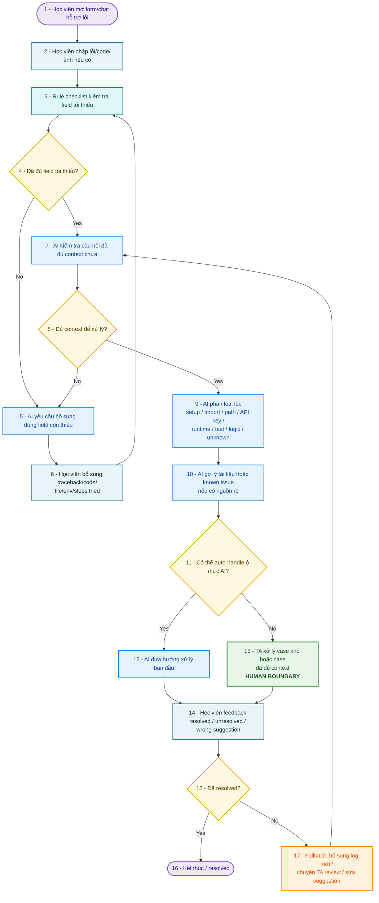
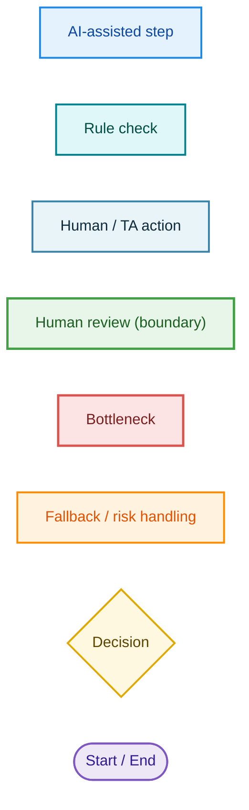

# Group Problem Statement — AI Intake Assistant cho lỗi code trong lab

> **Group 3**:
Thành viên:   

---

# Phase 3 — Group Convergence

## Bước 3.1 — Trình bày top 3

| \# | Người đưa ra | Candidate problem | Người gặp vấn đề | Điểm nghẽn | Cảm nhận nhanh |
| :---- | :---- | :---- | :---- | :---- | :---- |
| 1 | Vang | Centralized Notification Hub — gom thông báo từ Mail/Discord/Zalo/Teams về 1 dashboard | Học viên khóa AI (vừa đi làm vừa học) | Lọc tin BTC ra khỏi mớ chat trên nhiều app | Pain rộng, integration nặng, vấn đề security |
| 2 | Vang | Instant Q\&A Support — AI TA RAG 24/7 trả lời lỗi code | Học viên \+ đội TA (lớp \~500) | Chờ TA phản hồi 6–12h | Trùng không gian với \#6, scope to hơn |
| 3 | Hạnh | Knowledge search nội bộ — tìm context rải rác Slack/Jira/GitHub/Drive | Junior/Intern/Fresher/PM mới | Tìm \+ xác minh \+ tổng hợp context cũ | Data access nội bộ phức tạp |
| 4 | Hạnh | Meeting recap / action items — draft recap có decision/owner/deadline | PM, comtor, team lead, dev | Biến note rời rạc thành recap có cấu trúc | Pattern "draft \+ human review" sạch |
| 5 | Hạnh | Onboarding người mới — AI assistant trên README/issue/log | Intern, fresher, mentor | Setup lỗi \+ hiểu convention phụ thuộc mentor | Non-AI alternative quá mạnh |
| 6 | Tấn | **Intake assistant lỗi code** — HV thiếu context → AI hỏi bổ sung trước khi chuyển TA | Học viên \+ TA/Lab Coach | Câu hỏi đầu thiếu context → TA hỏi lại nhiều vòng | Scope gọn nhất, dễ làm trong lab |
| 7 | Mây | Mock interview multi-agent — Interviewer \+ Evaluator \+ Coach | Sinh viên cuối khóa \+ career switcher | Thiếu reps mock có rubric; chờ senior 1 tuần/lần | Evidence tốt nhưng Agent scope lớn |

*Đây là tổng hợp các best idea của thành viên*

## Bước 3.2 — Gom trùng / cluster

| Cluster | Candidates included | Pattern chung | Ghi chú |
| :---- | :---- | :---- | :---- |
| A — Hỗ trợ / hỏi-đáp lỗi trong lab | \#6 Intake assistant, \#2 Q\&A RAG | Học viên gặp lỗi → cần TA hỗ trợ nhanh | \#6 là bản thu hẹp thông minh của \#2 |
| B — Draft narrative từ nguồn rời rạc | \#4 Meeting recap, \#1 Notification hub | Gom nhiều input lộn xộn → viết lại có cấu trúc | Đúng pattern bài "Weekly Report" trong mẫu |
| C — Tìm context / knowledge nội bộ | \#3 Knowledge search, \#5 Onboarding | Knowledge bị phân tán, phải hỏi senior | Vướng data-access nội bộ |
| D — Luyện tập / mô phỏng có rubric | \#7 Mock interview | Thiếu reps \+ thiếu feedback structured | Cần multi-agent → nặng |

## Bước 3.3 — Shortlist

| Candidate | Vì sao vào shortlist | Rủi ro / điều chưa rõ |
| :---- | :---- | :---- |
| \#6 Intake assistant lỗi code | Actor \+ workflow \+ bottleneck đều rõ; scope nhỏ, gần như chắc làm xong trong lab; AI chỉ intake (không thay TA) | Chưa có số baseline thật; cần log lab để đo |
| \#4 Meeting recap | Pattern "AI draft \+ human review" sạch; có research; transcript dễ mô phỏng | Actor hơi rộng; metric quality recap khó thống nhất |
| \#7 Mock interview | Evidence tốt nhất (mini-survey); justify Agent hợp lý; metric rõ | Multi-agent \+ voice \+ history → scope quá lớn cho lab |

## Bước 3.4 — Score để đồng thuận

| Candidate | Actor rõ | Workflow rõ | Pain có evidence | Impact đo được | Làm trong lab | So sánh R/W/A được | Nhóm hiểu domain | Tổng |
| :---- | ----: | ----: | ----: | ----: | ----: | ----: | ----: | ----: |
| \#6 Intake assistant lỗi code | 5 | 5 | 3 | 4 | 5 | 5 | 5 | **32** |
| \#4 Meeting recap | 4 | 5 | 4 | 4 | 4 | 5 | 4 | **30** |
| \#7 Mock interview | 5 | 5 | 4 | 4 | 2 | 4 | 5 | **29** |

Candidate nhóm chọn:

\#6 — AI Intake Assistant cho lỗi code trong lab

Trong các buổi lab lập trình, học viên thường gửi câu hỏi lỗi code/setup thiếu thông tin tối thiểu như full traceback, đoạn code liên quan, file đang chạy, môi trường, package version và các bước đã thử, khiến TA phải hỏi lại nhiều vòng trước khi có thể bắt đầu phân tích lỗi.

## Vì sao chọn:

* Có actor rõ: học viên và TA/Lab Coach.  
* Có workflow hiện tại rõ: học viên gặp lỗi → gửi câu hỏi thiếu thông tin → TA hỏi lại → học viên bổ sung → TA mới debug được.  
* Có bottleneck cụ thể: câu hỏi ban đầu thiếu traceback, code, file/cell, môi trường, package version hoặc bước đã thử.  
* Có metric đo được: số vòng hỏi lại, tỷ lệ câu hỏi đủ context lần đầu, thời gian đến khi TA có thể bắt đầu xử lý.  
* Có thể làm trong lab với scope nhỏ: dùng checklist/form hoặc AI intake assistant trước khi chuyển TA.  
* Có thể so sánh rõ giữa Rule, Workflow và Agent.  
* Có human boundary rõ: AI không tự sửa bài, không tự chấm bài, không tự xử lý case phức tạp.

## **Vì sao không chọn các candidate còn lại:**

\- \#4 Meeting recap: rất mạnh và cùng pattern, để làm runner-up. Loại nhẹ vì actor  
  rộng hơn và metric chất lượng recap khó chốt nhanh trong lab.

\- \#7 Mock interview: pain/justify tốt nhưng multi-agent \+ voice \+ history là scope  
  quá lớn, rủi ro không kịp deadline.

\- \#2 Q\&A RAG: trùng \#6 nhưng to hơn; nhảy thẳng vào RAG bot, eval chất lượng khó.

\- \#3, \#5: vướng data-access nội bộ (Slack/Jira/GitHub/Drive), dễ phình thành  
  search/agent system; \#5 còn bị non-AI alternative mạnh đến mức nghiêng Rule.

\- \#1 Notification hub: thiếu evidence, phải kéo data từ 4 nền tảng → integration nặng.

# **Phase 4 — Quick Validation \+ Research giải pháp**

## Bước 4.1 — Quick validation

**Cách chọn:** Option A (quick interview 2–3 TA/học viên) Mục tiêu chính: lấy baseline cho 3 metric và xác nhận bottleneck "thiếu context" có thật.

Câu hỏi interview (TA):

- Trong 1 buổi lab, khoảng bao nhiêu % câu hỏi lỗi code bạn phải hỏi lại vì thiếu thông tin?  
- Trung bình hỏi lại mấy vòng trước khi đủ context để bắt tay xử lý?  
- Phần thiếu hay gặp nhất là gì? (traceback / code / file / package / môi trường / bước đã thử)

Câu hỏi poll (học viên):

- Khi gửi lỗi, bạn có thường bị TA hỏi lại "gửi đủ traceback/code/env" không? (Có/Không/Thỉnh thoảng)  
- Mức độ đáng giải quyết: 1–5?

Kết quả:

| Nguồn | Số người / số mẫu | Tín hiệu xác nhận | Tín hiệu phản bác | Nhóm sửa problem thế nào |
| :---- | ----: | :---- | :---- | :---- |
| Interview (TA) | ⟪cần hỏi⟫ | ⟪vd: x/y TA xác nhận phải hỏi lại ≥2 vòng⟫ | ⟪vd: lỗi quá đa dạng, khó checklist hóa⟫ | ⟪vd: giới hạn phạm vi 5 loại lỗi phổ biến⟫ |
| Survey / poll (học viên) | ⟪cần hỏi⟫ | ⟪cần điền⟫ | ⟪cần điền⟫ | ⟪cần điền⟫ |

Insight sau validation:

⟪Giả thuyết cần xác nhận: pain thật không nằm ở "TA chậm", mà ở "câu hỏi đầu vào  
thiếu context khiến vòng hỏi-đáp bị kéo dài". Nếu log xác nhận ≥2 vòng/câu thì giữ  
nguyên hướng intake; nếu phần lớn câu đã đủ context thì thu hẹp sang phân loại/định tuyến.⟫

## Bước 4.2 — Research giải pháp đã có

| Nguồn / tool / case | Link | Họ giải quyết phần nào? | Điểm mạnh | Khoảng trống / rủi ro | Bài học cho nhóm |
| :---- | :---- | :---- | :---- | :---- | :---- |
| GitHub Issue Forms (YAML form schema, required fields) | [https://docs.github.com/en/communities/using-templates-to-encourage-useful-issues-and-pull-requests/about-issue-and-pull-request-templates](https://docs.github.com/en/communities/using-templates-to-encourage-useful-issues-and-pull-requests/about-issue-and-pull-request-templates) | Ép người báo lỗi điền field bắt buộc (mô tả, repro steps, version/env) ngay khi mở issue | Đơn giản, không cần AI, validation per-field, giảm back-and-forth | Form **tĩnh**: hỏi cứng, không hỏi lại theo phần thiếu, không phân loại, người dùng vẫn bỏ field | Đây chính là mức **Rule** của bài — dùng làm baseline & fallback, AI chỉ cần thêm phần "hỏi lại động \+ phân loại" |
| Stack Overflow — Minimal Reproducible Example / "How to ask" | [https://stackoverflow.com/help/minimal-reproducible-example](https://stackoverflow.com/help/minimal-reproducible-example) | Chuẩn cộng đồng về câu hỏi đủ context (minimal \+ complete \+ reproducible) | Định nghĩa rõ thế nào là "câu hỏi đủ thông tin" → dùng làm rubric checklist | Chỉ là tài liệu/social norm, không tự động; người mới vẫn không biết áp dụng | Lấy MRE làm **định nghĩa "đủ context"** cho AI kiểm tra (traceback \+ code tối thiểu \+ cách chạy \+ kết quả quan sát) |
| Dosu — AI issue triage/response cho GitHub | [https://dosu.dev/](https://dosu.dev/) | AI phân loại, dedup, trả lời câu hỏi dựa trên codebase/docs có **citation**, có "should-publish gate" trả về PUBLISH/HOLD kèm confidence | Đúng mô hình HITL: AI có cơ sở thì trả lời, không chắc thì giữ lại cho người | Là sản phẩm thương mại, gắn GitHub, cần knowledge base; vượt scope lab nếu copy nguyên | Mượn đúng 2 ý: (1) **guardrail confidence → tự trả lời hay chuyển TA**; (2) trả lời phải có **nguồn**. Không bê nguyên hệ thống |
| CS50 Duck AI (Harvard University) & Codio Coach  | [https://www.google.com/search?q=https://cs50.ai\&authuser=2](https://www.google.com/search?q=https://cs50.ai&authuser=2) |[https://www.codio.com/features/coach-ai-learning-assistant](https://www.codio.com/features/coach-ai-learning-assistant)   | Hoạt động như một trợ giảng 24/7 tích hợp ngay trong môi trường học tập (LMS/IDE). Nhận diện mã lỗi (Traceback) và giải thích từng bước cho học viên.  | **Kỷ luật sư phạm cực cao:** Được cấu hình prompt nghiêm ngặt để *không bao giờ cho thẳng đáp án/code sửa lỗi*. Thay vào đó, AI đóng vai trò gợi mở (Socratic method). **Sâu sát ngữ cảnh bài học:** AI được nạp sẵn đề bài Lab, cấu trúc thư mục chuẩn của bài tập đó nên hiểu rõ học viên đang kẹt ở bước nào. | Các công cụ này chạy trong **môi trường khép kín (IDE tích hợp trên web)**. Còn học viên chạy trên môi trường mở (Local, Google Colab) rồi quăng lỗi lên Group Chat. Mô hình của CS50 không có tính năng "chặn và đòi context" khi dữ liệu đầu vào bị thiếu từ phía chat tự do.  | Hệ thống Prompt của Tầng 2 (Gợi ý xử lý) phải học tập nhóm này: **Tuyệt đối không viết hộ code**, chỉ giải thích bản chất lỗi (ví dụ: *"Bạn đang truyền thiếu tham số vào hàm X, hãy kiểm tra lại dòng số 12"*).  |
| OpenClaw Bug Triage Agent & Lyzr AI Agents  | [https://www.shopclawmart.com/blog/automate-bug-report-triage-ai-agent](https://www.shopclawmart.com/blog/automate-bug-report-triage-ai-agent) |[https://www.lyzr.ai/ai-agents/ai-agents-for-bug-triaging/](https://www.lyzr.ai/ai-agents/ai-agents-for-bug-triaging/)   | Định nghĩa một "Intake Schema" (JSON) bắt buộc. Khi có bug đổ về từ Jira/Slack, AI sẽ quét xem có đủ trường dữ liệu chưa. Nếu thiếu, AI kích hoạt "Enrichment Node" để tự động gọi API từ hệ thống (Sentry, Log) điền nốt vào form dữ liệu.  | Đầu ra gửi cho con người (Kỹ sư/TA) cực kỳ tường minh, chuẩn hóa dưới dạng JSON/Ticket sạch sẽ. Phân loại lỗi (Classification) tự động vào các nhóm: Lỗi hệ thống, lỗi API, lỗi cú pháp để định tuyến (Route) đúng người xử lý. | Các framework này thiết kế cho môi trường Doanh nghiệp (Kỹ sư, QA) — nơi dữ liệu log có sẵn qua API để AI tự điền (enrich). Đối với học viên, máy tính của họ là Local, AI không thể tự gọi API quét log được, bắt buộc phải dùng **giao tiếp hội thoại** để đòi học viên tự cung cấp.  | Phải tách biệt 2 giao diện: Đầu vào với học viên là **Chatbot mềm dẻo, kiên nhẫn**, nhưng đầu ra bàn giao cho TA phải là một **Hồ sơ lỗi đóng gói có cấu trúc gọn gàng**.  |
| Kapa.ai & Mendable.ai  | [https://www.kapa.ai](https://www.kapa.ai) |[https://www.mendable.ai](https://www.mendable.ai)  | Triển khai Bot cắm vào Discord/Slack của các cộng đồng công nghệ lớn. Khi có user hỏi lỗi, Bot tự động tạo một Thread riêng để cô lập hội thoại, phân tích câu hỏi dựa trên tài liệu (Documentation/RAG) và yêu cầu cung cấp thêm thông tin nếu câu hỏi quá ngắn.  | Khả năng xử lý hội thoại tự nhiên xuất sắc, bóc tách được các thực thể (như tên thư viện, đoạn code) trong một đống text hỗn loạn của user. Có sẵn cơ chế Phân tích cảm xúc (Sentiment) để phát hiện khi nào user đang bực tức nhằm ping con người vào can thiệp ngay. | **Chi phí Token cao:** Đọc hiểu ảnh chụp và duy trì hội thoại dài trên các group chat ngốn rất nhiều tài nguyên. **Vòng lặp vô tận (AI Loop):** Nếu học viên không biết cách lấy traceback, AI cứ hỏi đi hỏi lại câu "Hãy gửi traceback" sẽ tạo ra trải nghiệm cực kỳ ức chế. | Cần cài đặt **Guardrail "Quá tam ba bận"**. Nếu AI hỏi đến lần thứ 2 mà học viên vẫn không cung cấp đúng ngữ cảnh, tự động chuyển luồng (Bypass) cho TA và báo cáo rõ: *"Học viên không biết cách lấy thông tin này"*.  |

Bài học tổng:

* **Xây "gác cổng" thông minh, tránh bẫy vòng lặp (AI Loop):** Dùng tiêu chuẩn MRE (Stack Overflow) làm checklist để AI duyệt thông tin, nhưng bắt buộc phải cài quy tắc "quá tam ba bận" (Kapa.ai) — nếu hỏi đến lần thứ 2 học viên vẫn không đưa được context, lập tức bypass chuyển thẳng cho TA để tránh gây ức chế.  
* **Đầu vào hội thoại mềm dẻo, đầu ra đóng gói cấu trúc:** Giữ giao diện chat tự nhiên, kiên nhẫn khi đòi thông tin từ học viên, nhưng khi bàn giao cho TA phải chuyển đổi thành một **"Hồ sơ lỗi" dạng JSON sạch sẽ** (OpenClaw). TA nhìn vào là biết ngay môi trường, mã lỗi và các bước đã thử mà không cần đọc lại cả đoạn chat dài.  
* **Giữ kỷ luật sư phạm và biết "tự lượng sức" (HITL):** Prompt cho AI chỉ giải thích bản chất lỗi và gợi mở giải pháp chứ không bao giờ viết hộ code (CS50). Đồng thời, cài đặt **Cổng kiểm soát độ tự tin** (Dosu) — ca nào AI không chắc chắn hoặc có rủi ro cao, tự động giữ lại để chuyển TA xử lý kèm trích dẫn tài liệu bài học liên quan.


# Phase 5 — Workflow + Problem Statement 

### Bước 5.1 — Workflow before/after

#### BEFORE — Current state 



#### AFTER — Future state (AI Intake Assistant cho lỗi code/setup)



#### Legend



**Fallback**: nếu AI không tìm được nguồn hoặc không tự tin → tự động đẩy về TA, **không bao giờ đoán**. HV luôn xem được nguồn AI dùng để tự kiểm chứng.

- **Rule xử lý:** checklist field bắt buộc tối thiểu (giống GitHub issue form).
- **AI/Workflow hỗ trợ:** kiểm tra đủ context (b2), hỏi lại động (b3), phân loại (b4), gợi ý có cơ sở (b5), guardrail (b6).
- **Con người vẫn làm:** TA xử lý case khó / không chắc / liên quan bài nộp (b7).
- **Boundary:** AI không tự kết luận lỗi phức tạp; không trả lời khi không có nguồn.
- **Quay về nếu AI sai:** chuyển toàn bộ context sang TA; học viên luôn xem được câu trả lời gốc để tự kiểm chứng.

Before/after impact:

| Metric | Trước | Sau kỳ vọng | Ghi chú |
|---|---:|---:|---|
| Số bước (HV + TA) | 7 | ~4 hữu ích (b2–b5 tự động) | HV chủ yếu thao tác b1 + đọc kết quả |
| Tổng thời gian đến khi TA bắt đầu xử lý | 20 phút | Giảm | Cần timestamp trước/sau |
| Số bước thủ công của TA | 4 (đọc, hỏi lại, nhận bổ sung, phân tích) | 1–2 (chỉ phân tích case khó đã đủ context) | TA hết phải đi "đòi" thông tin |
| Bottleneck chính | TA hỏi lại nhiều vòng | TA review case khó đã đủ context | Bottleneck dời chứ không biến mất |
| Risk mới | (không có AI) | AI hỏi sai / gợi ý sai | Kiểm soát bằng guardrail + HITL + fallback |

##  Problem Statement v0

| Field | Nội dung |
|---|---|
| **Actor** | Học viên đang làm lab AI (chạy code local/Colab, cài thư viện, dùng API key, chạy test) và TA/Lab Coach hỗ trợ lớp. |
| **Workflow** | HV gặp lỗi → gửi ảnh/mô tả ngắn lên group → TA đọc → TA hỏi lại phần thiếu → HV bổ sung (lặp) → TA phân tích → TA trả lời. |
| **Bottleneck** | Câu hỏi ban đầu thiếu context (traceback/code/file/env/bước đã thử) → TA phải hỏi lại nhiều vòng trước khi xử lý được. |
| **Impact** | HV chờ lâu; TA tiêu thời gian thu thập thông tin thay vì giải lỗi; câu hỏi khác bị chậm theo; trải nghiệm lab giảm. |
| **Success Metric** | (1) Số vòng hỏi lại trung bình/câu: ⟪baseline⟫ → giảm. (2) Tỷ lệ câu hỏi đủ traceback/code/file/env ngay lần đầu: ⟪baseline⟫ → tăng. (3) Thời gian từ lúc HV hỏi đến lúc TA bắt đầu xử lý: ⟪baseline⟫ → giảm.  |
| **Boundary** | **Làm:** kiểm tra đủ context, hỏi lại phần thiếu, phân loại lỗi sơ bộ, gợi ý khi có cơ sở rõ. **Không làm:** không tự kết luận lỗi phức tạp, không trả lời khi thiếu nguồn, không xử lý case liên quan bài nộp chính thức → chuyển TA. |

---

# Phase 6 — Rule / Workflow / Agent + Decision 

## Bước 6.0 — Ma trận độ phù hợp với AI


| Câu hỏi | Trả lời | Kết luận |
|---|---|---|
| Output có thể khác nhau mỗi lần mà vẫn chấp nhận được không? | Phần intake/kiểm-tra-field: KHÔNG (đúng/sai rõ). Phần phân loại lỗi: theo nhóm cố định (setup/API/path/test/runtime). | Độ mơ hồ **thấp → trung bình** |
| Cần phối hợp 3+ bước hoặc 3+ nguồn dữ liệu không? | Vài bước nhưng tuyến tính, ít nguồn (chính là input của học viên). | Độ phức tạp **thấp** |
| AI có cần tự quyết định bước tiếp theo không? | Không — luồng cố định: kiểm tra → hỏi thiếu → phân loại → guardrail → chuyển TA. | **Rule/Workflow đủ** |

Bài toán của nhóm nằm ở ô nào?

```text
Độ phức tạp thấp × độ mơ hồ thấp-trung → "Workflow có AI hỗ trợ một vài bước".
KHÔNG thuộc ô Agent.
```

Vì sao?

```text
Các bước rõ ràng và tuyến tính; "độ mơ hồ" chỉ xuất hiện ở khâu gợi ý cách xử lý, và
khâu đó đã bị chặn bằng guardrail (chỉ gợi ý khi có cơ sở, còn lại chuyển TA). Không
có nhu cầu để AI tự lập kế hoạch hay tự đổi bước tiếp theo.
```

## Bước 6.1 — So sánh Rule / Workflow / Agent

| Mức | Phương án cho bài toán nhóm | Khi nào đủ | Rủi ro | Chọn? |
|---|---|---|---|---|
| **Rule** | Form/checklist bắt buộc field (traceback, code, file, package, env, bước đã thử) — kiểu GitHub issue form | Khi học viên chịu điền đúng & lỗi thuộc loại phổ biến | Hỏi cứng, không hỏi lại theo phần thiếu, không phân loại; học viên vẫn bỏ field/điền ẩu | Một phần — dùng làm **baseline + fallback** |
| **Workflow + AI** | AI kiểm tra đủ context → hỏi lại đúng phần thiếu (động) → phân loại lỗi → gợi ý khi có cơ sở → guardrail tự trả lời/chuyển TA | Khi cần phần "hỏi lại thông minh + phân loại" mà form tĩnh không làm được; các bước vẫn rõ | AI hỏi/gợi ý sai → kiểm soát bằng guardrail + HITL + fallback | ✅ **Chọn** |
| **Agent** | AI tự lập kế hoạch debug, tự chạy code, tự quyết định và tự giải lỗi | Khi lỗi cần điều phối nhiều tool + nhiều bước phụ thuộc động | Học viên dễ bị dẫn sửa sai; khó kiểm soát/eval trong lab; vượt nhu cầu | ❌ Không |

Mức chọn:

```text
Workflow + AI
```

Vì sao chọn:

```text
Form tĩnh (Rule) không hỏi lại được đúng phần còn thiếu và không phân loại lỗi — đó
chính là chỗ vòng hỏi-đáp bị kéo dài. Một workflow có AI hỗ trợ ở khâu intake giải
đúng bottleneck mà vẫn giữ luồng rõ ràng, dễ gắn guardrail và HITL.
```

Vì sao không chọn mức đơn giản hơn (chỉ Rule):

```text
Rule giải được phần "ép đủ field" nhưng không adaptive: học viên thiếu đúng cái gì thì
form không biết để truy hỏi, và không phân loại được lỗi để định tuyến. Vẫn giữ Rule
làm lớp nền + fallback, nhưng không đủ một mình.
```

Vì sao không chọn mức phức tạp hơn (Agent):

```text
Luồng đã rõ và tuyến tính, không cần AI tự lập kế hoạch/đổi bước. Agent làm tăng rủi ro
học viên sửa sai và khó kiểm soát/đánh giá trong phạm vi lab. Có thể "hạ mức" an toàn về
Workflow mà vẫn đạt mục tiêu.
```

## Bước 6.2 — Problem Statement v1

| Field | Nội dung |
|---|---|
| **Actor** | Học viên làm lab AI + TA/Lab Coach. |
| **Workflow** | (như v0) HV gặp lỗi → gửi → TA hỏi lại thiếu → HV bổ sung (lặp) → TA phân tích → TA trả lời. |
| **Bottleneck** | Câu hỏi đầu thiếu context → vòng hỏi lại kéo dài trước khi TA xử lý được. |
| **Impact** | HV chờ lâu; TA tốn thời gian thu thập thông tin; câu hỏi khác bị chậm. |
| **Success Metric** | (1) Số vòng hỏi lại TB/câu: ⟪baseline⟫ → giảm; (2) % câu đủ context lần đầu: ⟪baseline⟫ → tăng; (3) Thời gian đến khi TA bắt đầu xử lý: ⟪baseline⟫ → giảm. Cách đo: trích log chat lab + timestamp trước/sau. |
| **Boundary** | **Làm:** kiểm tra đủ context, hỏi lại phần thiếu, phân loại lỗi, gợi ý khi có cơ sở. **Không làm:** không kết luận lỗi phức tạp, không trả lời khi thiếu nguồn, không động vào bài nộp chính thức → chuyển TA. |
| **AI intervention point** | Bước 2–5 (kiểm tra context → hỏi lại động → phân loại → gợi ý có cơ sở) + guardrail ở bước 6. TA giữ bước 7. |
| **Mức chọn** | **Workflow + AI** (Rule làm nền/fallback; không Agent). |
| **Rủi ro & người thật kiểm tra** | Rủi ro: AI hỏi/gợi ý sai → học viên sửa sai. Kiểm soát: guardrail confidence (đủ chắc mới trả lời), TA review mọi case khó/không chắc/liên quan bài nộp, fallback "không chắc thì chuyển TA, không đoán", trả lời phải đính nguồn. |

## Bước 6.3 — Final decision

| Câu hỏi | Yes / Not Yet / No | Ghi chú |
|---|---|---|
| Actor và workflow đã rõ chưa? | **Yes** | Actor hẹp, workflow 7 bước rõ |
| Baseline và success metric đã đo được chưa? | **Not Yet** | Metric đã định nghĩa & đo được, nhưng chưa có số → Phase 4 phải đo |
| Có data/input đủ dùng chưa? | **Not Yet** | Cần trích log chat lab; ngắn hạn có thể tạo bộ câu hỏi mẫu để thử |
| Nếu AI sai, hậu quả có chấp nhận được không? | **Yes** | AI chỉ intake, không chốt; có HITL + fallback |
| Có người review/owner vận hành không? | **Yes** | TA/Lab Coach là owner; có vòng feedback học viên |
| Có cách non-AI đơn giản hơn không? | **Yes (một phần)** | Form bắt buộc; nhưng không hỏi lại động/không phân loại → AI bổ sung phần còn thiếu |

Decision:

```text
Not Yet → Go sau khi validate bằng log thật.
"Cổng" Go/No-Go chính thức gắn với việc đo baseline ở Phase 4 trên log chat lab thật.
Đo xong mà xác nhận pain (≥ ~2 vòng hỏi lại/câu, ≥ 50% câu thiếu context lần đầu)
→ chuyển sang Go đầy đủ và chạy pilot 1 tuần.
```

Lý do (vì sao Not Yet thay vì Go ngay):

```text
Actor/workflow/boundary rõ, rủi ro kiểm soát được (HITL + fallback), có non-AI baseline
(form tĩnh / GitHub issue form) để so sánh. NHƯNG chưa có số baseline thật từ log lab →
chưa biết bottleneck "TA hỏi lại nhiều vòng" có thật sự đủ lớn để biện minh build AI
hay không. Đây không phải lý do dừng, mà là việc cần làm NGAY trước khi cam kết build.
Nếu nhảy thẳng vào Go mà chưa validate, rủi ro là build xong mới phát hiện pain không
như giả định → lãng phí.
```

Pilot 1 tuần (sau khi validate baseline xong):

```text
1. Đo baseline 1 tuần: trích 20–30 câu hỏi lỗi gần nhất từ chat lab, đếm số vòng hỏi lại
   + % câu đủ context lần đầu + thời gian đến khi TA bắt đầu xử lý.
2. Định nghĩa "đủ context" theo chuẩn MRE (traceback + code tối thiểu + cách chạy +
   kết quả quan sát) → dùng làm rubric cho AI.
3. Dựng intake tối giản: checklist Rule (5 field bắt buộc) + 1 lớp AI hỏi lại phần thiếu
   (Wizard-of-Oz cũng được — TA đóng vai AI) trên ~10–15 câu hỏi mới.
4. AI phân loại lỗi sơ bộ (setup / API / path / test / runtime / unknown).
5. Guardrail: AI chỉ gợi ý khi có nguồn rõ; không chắc → chuyển TA kèm context đã đủ.
6. So baseline vs pilot trên 3 metric (số vòng hỏi lại, % câu đủ context lần đầu,
   thời gian đến khi TA xử lý).
7. Review weekly với TA: AI gợi ý đúng/sai? Học viên có bị dẫn sai không?
```

Exit / rollback criteria (khi nào dừng pilot):

```text
- AI hỏi sai phần thiếu > 20% số case → tắt phần hỏi lại động, giữ Rule form.
- AI gợi ý sai → học viên sửa sai (TA phát hiện) ≥ 2 case trong tuần → tắt phần gợi ý,
  chỉ giữ intake + phân loại.
- Sau pilot 1 tuần, số vòng hỏi lại không giảm rõ (< 20% giảm) → rollback về Rule form
  thuần, AI không cứu được pain này.
- Học viên feedback negative về trải nghiệm (cảm thấy bị "tra hỏi") → review lại UX.
```

Decision rationale (vì sao "Not Yet → Go" mà không phải Not Yet thuần):

```text
Nhóm KHÔNG ở chỗ "chưa hiểu bài toán" — đã có actor / workflow / boundary / Mức chọn /
HITL / fallback rõ. Chỉ thiếu evidence định lượng. Đây là dạng "Not Yet → Go có lộ trình"
chứ không phải "Not Yet → quay lại bàn vẽ". Việc cần làm tiếp theo cụ thể, đo được,
và chính nó cũng là bước đầu của pilot → không lãng phí.
```

Nếu No-Go (sau khi đo baseline thấy pain không như giả định):

```text
Triển khai Rule thuần: form/checklist bắt buộc kiểu GitHub issue form + tài liệu "cách
hỏi lỗi đủ context" (theo chuẩn MRE Stack Overflow) ghim trên kênh lab. Không build AI.
```
